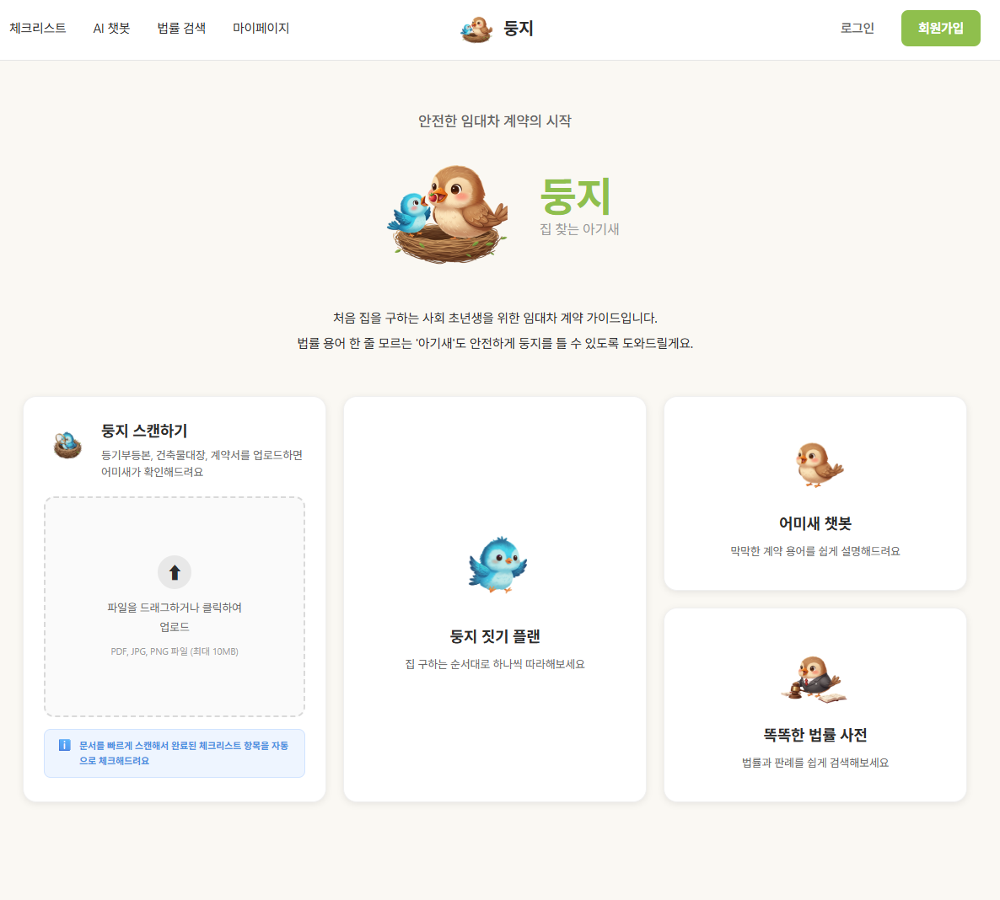
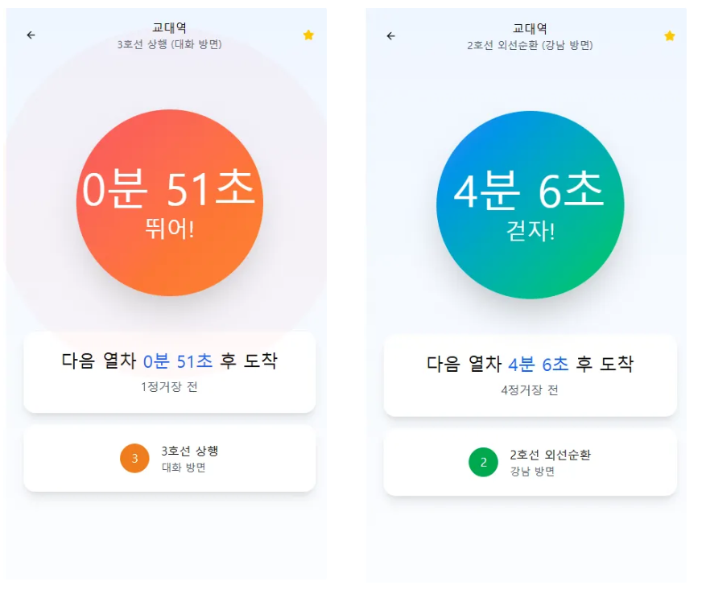
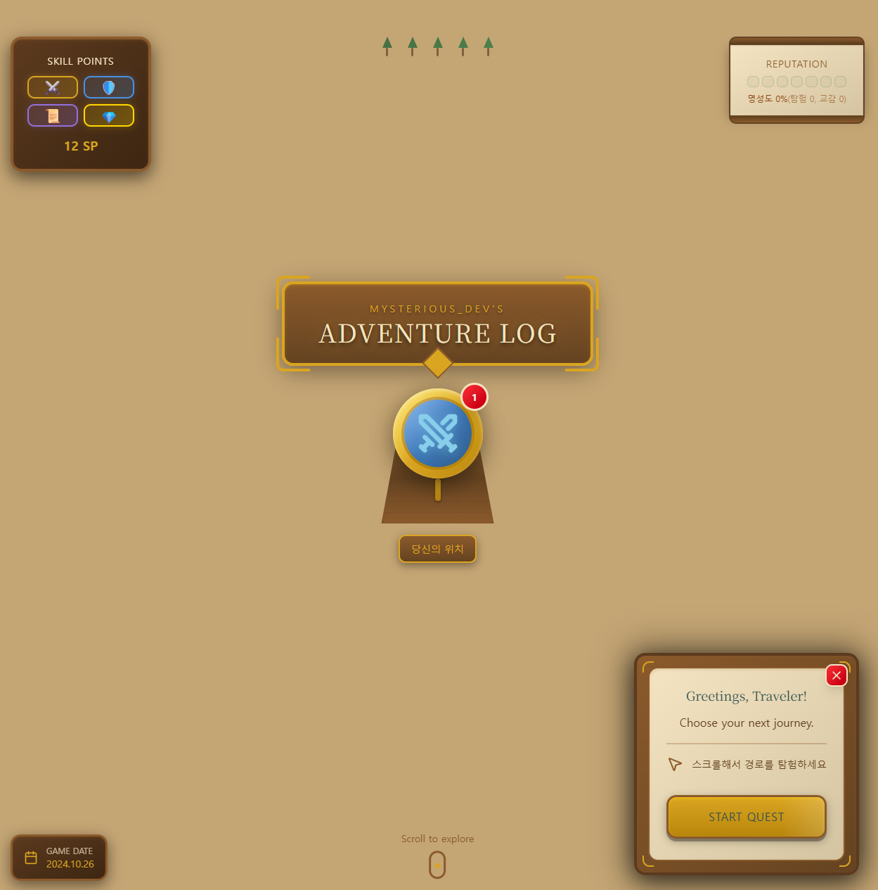

<!-- 컨트리 뱃지 박스 -->

   
  

 

<!-- 상단 배지 -->

  
  &nbsp;
  
  &nbsp;
  
  &nbsp;
   
  
  &nbsp;
  

  

<!-- 소개 섹션 -->

  

    <h2 style="color:#ffb6c1; margin-bottom: 12px; letter-spacing: 1px;">
      Hi, I'm <b>Junghyun Na 👋</b>
    </h2>
    

      FULL STACK Engineer & AI Learner. 
      Passionate about <b>서비스 기획 - 운영 - 배포 - 데이터 분석 - AI - 고도화</b>. 
      I love crafting clean architectures and elegant automation.  
      <i>"오늘 하루도 최선을 다하자"</i>
    

  

  

---
 

<h2 align="center">📌 프로젝트</h2>

---

<!-- 둥지 -->

### 🪺 둥지 (집 찾는 아기새)
> **팀 프로젝트 · AI 법률/부동산 비서**

임대차 계약의 **위험 요소를 자동 분석**하는 AI 기반 서비스입니다.  
등기부등본 · 건축물대장 · 계약서를 OCR로 분석하고,  
**LLM + MCP + n8n** 기반으로 실시간 체크리스트 검증을 수행합니다.

🔗 [사이트 바로가기](https://doongzi.site) · [GitHub](https://github.com/najung-h/Doongzifrontend)

---

<!-- 쉽길 -->

### 🚇 쉽길 (Wisheasy)
> 팀 프로젝트

지하철 역사 내 **에스컬레이터 기반 최적 이동 동선 안내 서비스**입니다.  
입력한 출·도착역 기준으로 **스토리 카드 형식**으로 이동 경로를 안내합니다.

🔗 [사이트](https://www.wisheasy.site/) · [GitHub](https://github.com/najung-h/project-wisheasy)

---

<!-- RunOrNot -->

### 🏃 뛸까말까 (RunOrNot)
> 개인 프로젝트

실시간 지하철 도착 정보를 기반으로  
지금 **뛰어야 할지 말아야 할지**를 직관적으로 알려주는 웹 서비스입니다.

🔗 [사이트](https://runornot.site) · [GitHub](https://github.com/najung-h/project-wishfast)

---

<!-- 포트폴리오 -->

### 🎮 게임형 포트폴리오
> 개인 포트폴리오

React + Tailwind로 만든 **애니메이션 인터랙션형 포트폴리오**입니다.

🔗 [사이트](https://na-journey.netlify.app/)

---

<!-- CV -->

### 📄 CV (najungh)
> 개인 이력서 · Docker Compose 배포

EC2 환경에서 Docker Compose로 배포한 개인 이력서 사이트입니다.

🔗 [사이트](https://www.najungh.site/) · [GitHub](https://github.com/najung-h/project-portfolio)

---

<!-- 블로그 카드 (단일) -->

  

    
    <h3 style="margin: 10px 0 4px; font-size: 18px; color: #3b3b3b;">티스토리 (SSAFYcial)</h3>
    

      SSAFY에서의 생활과 트러블 슈팅 등을 기록합니다. 
    

  

  

---

## 🔧 Tech Stack

 

### 💻 Languages

  
  
  <a href="https://solved.ac/profile/junghyun_na321">
    <!--  -->
  </a>

 

### 🎨 Frontend & Frameworks

  
  
  
  

 

### 🧱 Backend & Frameworks

  
  

   
  
  
     
     

 

### 🧪 Data & ML

  
  

  
  
  

  
  
  

  
  
  

 

### 🗄️ Databases 

  
  
  

 

### ⚙️ DevOps & CI/CD

  
  
  

  
  

  
  

  
  

 

### 🛠️ Tools & Design

  
  
  
  

 

### 🚀 Etc.

  
  
  

  

---
  

### 📜 자격증 및 수상

| 자격증명 / 수상명             | 발급 기관 / 주관               | 취득/진행 상태             |
|----------------------|--------------------------|----------------------------|
| ADsP                | 한국데이터산업진흥원     | 2023.11 취득               |
| SQLD                | 한국데이터산업진흥원     | 2024.04 취득               |
| 삼성 SW 역량테스트 A형 | 삼성전자                | 2025.09 취득               |
| SSAFY 이달의 동료         | 삼성청년SW아카데미(SSAFY) | 2025.08 수상               |
| AI NoCode·MCP Hackathon SEASON 2 | 과기정통부 · 한국지능정보사회진흥원 | 대상   |

  

### 📚 Education

| 단체명     | 내용                                     | 재학 기간         |
| ---------- | ---------------------------------------- | ----------------- |
| ㅇㅇ대학교 | 가정교육과 · 수학과 (이중전공)           | 2020.03 ~ 2025.08 |
| BADA       | ㅇㅇ대학교 경영데이터학회 (Business Analytics) | 2023.03 - 2023.12 |
| SSAFY      | 파이썬반                                 | 2025.07- 현재     |

  

### 💼 경력

| 회사명          | 직군     | 부서                  | 근무 기간        |
|------------------|----------|-----------------------|------------------|
| IBK 기업은행     | 디지털   | 경제연구소 중기산업연구실 | 2024.01-2024.02 |

  

---

## Commits

<!-- 3D 잔디 -->

<!-- Snake 애니메이션 -->

---

<!-- README 끝 -->
