<!-- 컨트리 뱃지 박스 -->

   
  

 

<!-- 상단 배지 -->

  
  &nbsp;
  
  &nbsp;
  <!--  -->
  
  &nbsp;
   
  
  &nbsp;
  

  

<!-- 소개 섹션 -->

  

    <h2 style="color:#ffb6c1; margin-bottom: 12px; letter-spacing: 1px;">
      Hi, I'm <b>Junghyun Na 👋</b>
    </h2>
    

      FULL STACK Data Engineer & AI Learner. 
      Passionate about <b>Data Pipeline - AI - Data Analytics - Devops - MLOps - BE - FE</b>. 
      I love crafting clean architectures and elegant automation.  
      <i>"오늘 하루도 최선을 다하자"</i>
    

  

  

 <!-- 블로그 카드 (단일) -->

  

    
    <h3 style="margin: 10px 0 4px; font-size: 18px; color: #3b3b3b;">티스토리 (SSAFYcial)</h3>
    

      SSAFY에서의 생활과 트러블 슈팅 등을 기록합니다. 
    

  

  

<!-- 포트폴리오 레포지토리 -->

  

    <a href="https://github.com/najung-h/portfolio" target="_blank" rel="noopener noreferrer">
      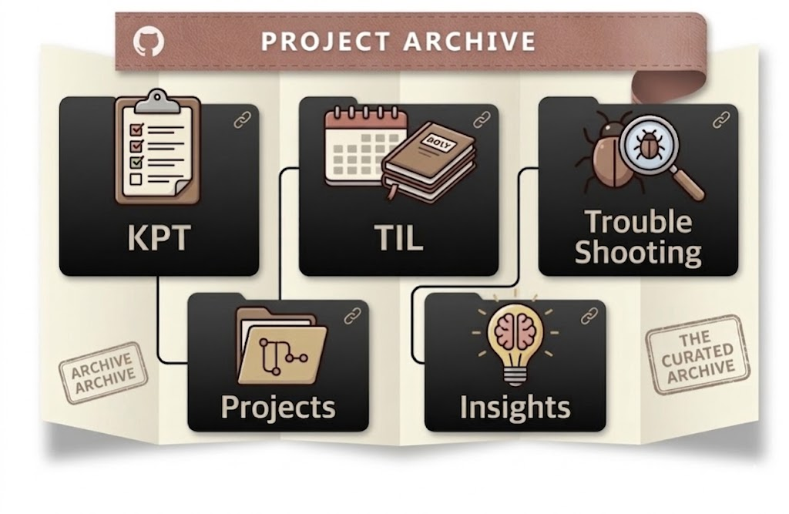
    </a>
    <h3 style="margin: 10px 0 4px; font-size: 18px; color: #3b3b3b;">아카이브 (Archive)</h3>
    

      KPT · TIL · Trouble Shooting · Projects · Insights 를 기록합니다. 
    

  

     

<!-- 3D 잔디 -->

---
  

### 📜 Awards

| 수상명                               | 주관               | 일자    |
| ------------------------------------ | ------------------ | ------- |
| AI NoCode·MCP Hackathon SEASON2 대상 | 과학기술정보통신부 | 2025.11 |
| SSAFY 공통프로젝트 우수상            | 삼성전자 주식회사  | 2026.02 |

  

### 📚 Education

| 단체명     | 내용                                     | 재학 기간         |
| ---------- | ---------------------------------------- | ----------------- |
| ㅇㅇ대학교 | 가정교육과 · 수학과 (이중전공) - 아동발달상담 · 인공지능의 수학적 기초 (마이크로 디그리) | 2020.03 ~ 2025.08 |
| BADA       | ㅇㅇ대학교 경영데이터학회 (Business Analytics) | 2023.03 - 2023.12 |
| SSAFY      | 파이썬반                                 | 2025.07- 현재     |

  

### 💼 경력

| 회사명          | 직군     | 부서                  | 근무 기간        |
|------------------|----------|-----------------------|------------------|
| IBK 기업은행     | 디지털   | 경제연구소 중기산업연구실 | 2024.01-2024.02 |

  

---
 

<h2 align="center">📌 프로젝트</h2>

---

<!-- 둥지 -->

### 🪺 둥지 (집 찾는 아기새)
> **팀 프로젝트 · PM / AI · 법률/부동산 비서**

<a href="https://doongzi.site" target="_blank">
  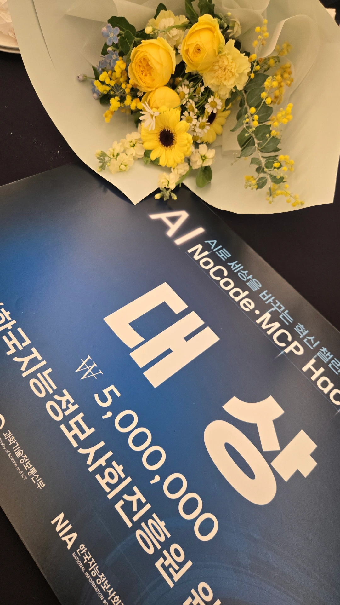
  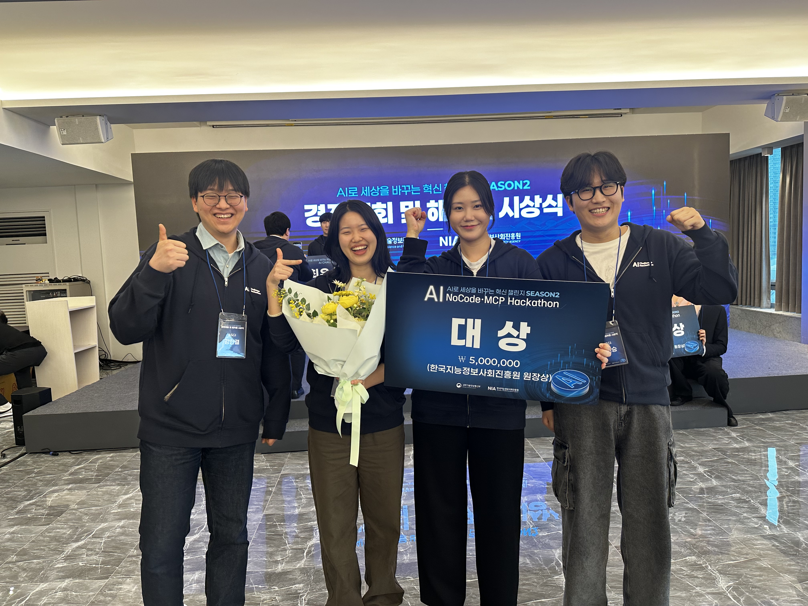
  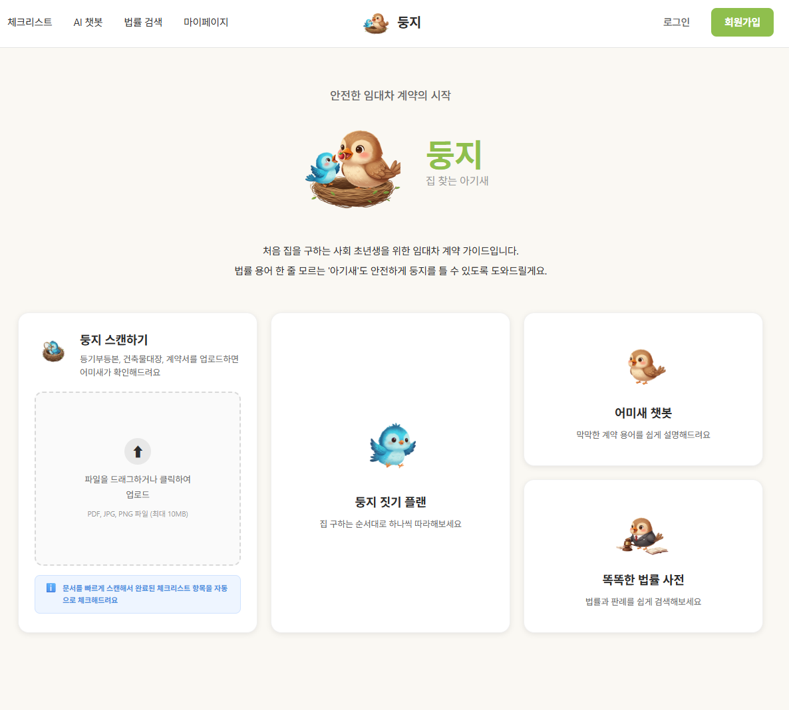
</a>

임대차 계약의 **위험 요소를 자동 분석**하는 AI 기반 서비스입니다.  
등기부등본 · 건축물대장 · 계약서를 OCR로 분석하고,  
**LLM + MCP + n8n** 기반으로 실시간 체크리스트 검증을 수행합니다.

🔗 [사이트 바로가기](https://doongzi.site) · [GitHub](https://github.com/najung-h/Doongzifrontend)

---

<!-- 아이타임(AI-Time) -->

### 👶 아이타임 (AI-Time)
> **팀 프로젝트 · AI · 자폐 진단 디지털 의료기기**

<table>
  <tr>
    <td align="center" width="50%">
      <strong>[의사] 검사 결과 조회</strong> 
      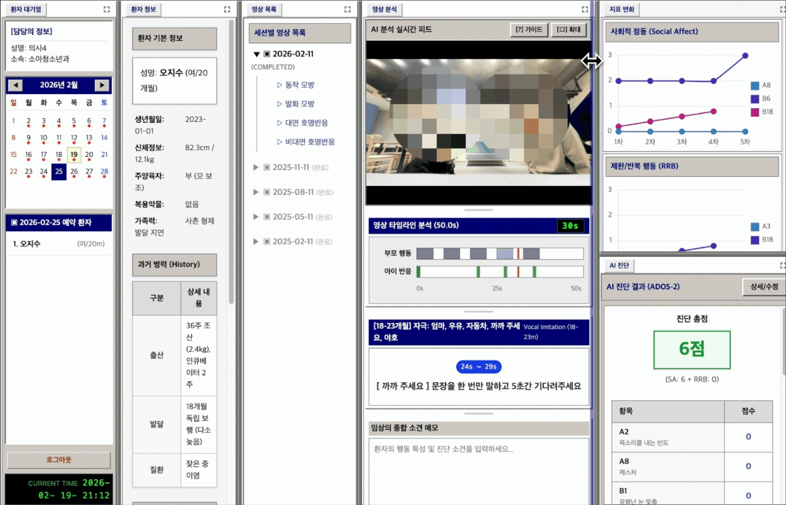
    </td>
    <td align="center" width="50%">
      <strong>[보호자] 검사 주의사항 안내 및 시작 페이지</strong> 
      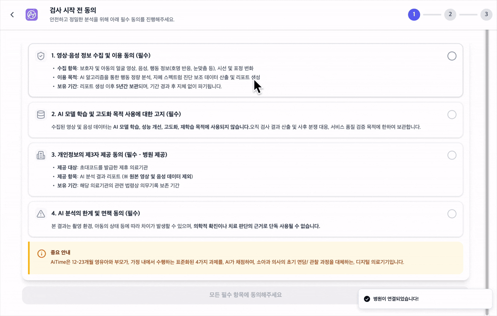
    </td>
  </tr>
</table>
영유아 행동 영상을 분석해 **ASD 행동 지표(눈맞춤, 호명반응, 모방행동)**를 자동 측정하는 AI 진단 보조 솔루션입니다.  
비전 · 음성 기반 **행동 분석 파이프라인**을 통해 행동 데이터를 정량화하고 의사 대시보드로 제공합니다.  
최대 **1년 이상 발생하는 ASD 진단 대기 문제를 완화**하고 조기 치료 개입을 지원합니다.

🔗 [사이트 바로가기](https://i14a501.p.ssafy.io/) · [GitHub](https://lab.ssafy.com/s14-webmobile1-sub1/S14P11A501/)

---

<!-- 허수아비 -->

### 🪺 허수아비
> **팀 프로젝트 · BE/DE · 공항 조류충돌 예방 서비스**

<table>
  <tr>
    <td align="center" width="50%">
      <strong>[실시간] 레이더 및 CCTV 수신 
      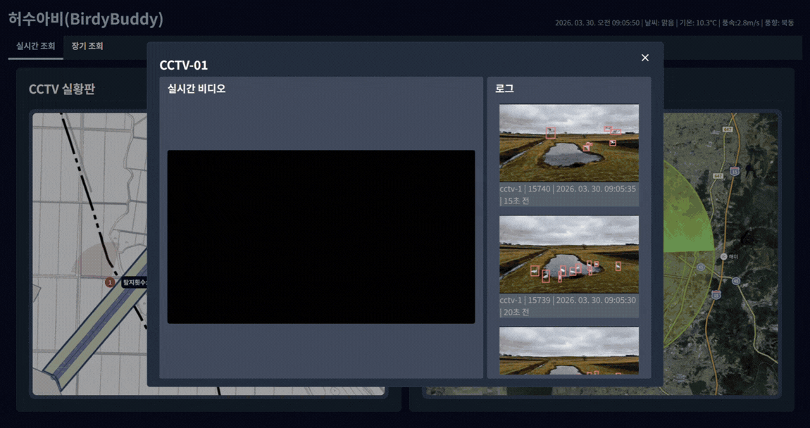
    </td>
    <td align="center" width="50%">
      <strong>[장기분석] 레이더 및 CCTV 분석</strong> 
      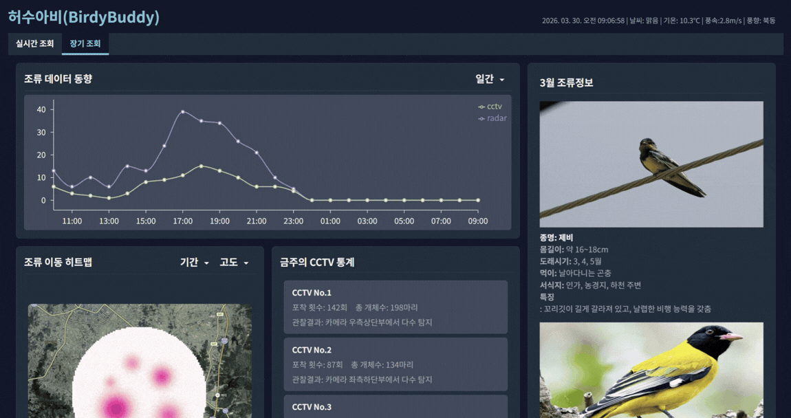
    </td>
  </tr>
</table>
Kafka + Spark + Hadoop + Yolo 을 이용해,  
공항 조류충돌 실시간 위험을 확인하고  
장기 통계 분석 및 시각화를 진행합니다.

🔗 [사이트 바로가기](https://j14a206a.p.ssafy.io/) · [GitHub](https://github.com/najung-h/project-birdybuddy)

---

<!-- 라이프런 -->

### 📚 라이프런(LIFE-LEARN)
> **팀 프로젝트 · BE · 개인화 강의 추천**

<a href="https://doongzi.site" target="_blank">
  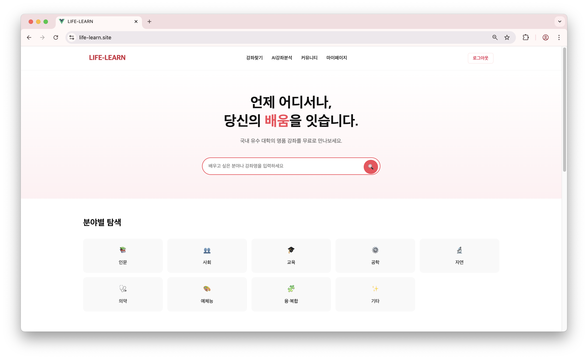
</a>

K-MOOC 플랫폼의 사용자 경험을 개선하고,
AI 기반 개인화 추천 시스템을 제공하는 온라인 강좌 학습 플랫폼입니다.
이로써, 시간이 부족한 현대 사회인에게 맞춤화된 교육 경험을 제공하는 데 의의를 두고 있습니다.

🔗 [사이트 바로가기](https://life-learn.site) · [GitHub](https://github.com/najung-h/project-lifelearn)

---

<!-- 쉽길 -->

### 🚇 쉽길 (Wisheasy)
> **팀 프로젝트 · PM /INFRA · 지하철 에스컬레이터 환승 경로 탐색**

<table>
  <tr>
    <td align="center" width="50%">
      <strong>카드형 이동 안내</strong> 
      
    </td>
    <td align="center" width="50%">
      <strong>역사 기본 정보 조회</strong> 
      
    </td>
  </tr>
</table>

지하철 역사 내 **에스컬레이터 기반 최적 이동 동선 안내 서비스**입니다.  
입력한 출·도착역 기준으로 **스토리 카드 형식**으로 이동 경로를 안내합니다.

🔗 [사이트](https://www.wisheasy.site/) · [GitHub](https://github.com/najung-h/project-wisheasy)

---

<!-- RunOrNot -->

### 🏃 뛸까말까 (RunOrNot)
> **개인 프로젝트 · FE**

<a href="https://runornot.site" target="_blank">
  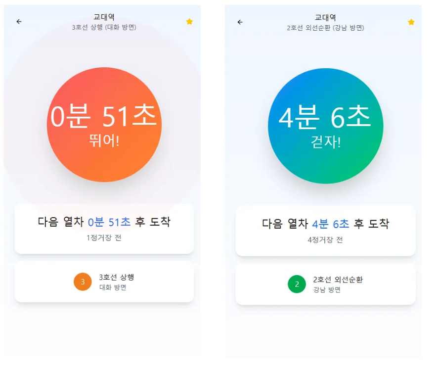
</a>

실시간 지하철 도착 정보를 기반으로  
지금 **뛰어야 할지 말아야 할지**를 직관적으로 알려주는 웹 서비스입니다.

🔗 [사이트](https://runornot.site) · [GitHub](https://github.com/najung-h/project-wishfast)

---

<!-- 포트폴리오 -->

### 🎮 게임형 포트폴리오
> **개인 포트폴리오**

<a href="https://na-journey.netlify.app/" target="_blank">
  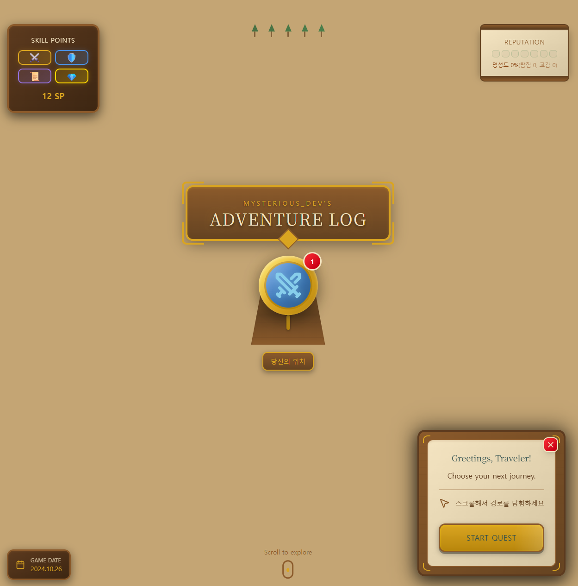
</a>

React + Tailwind로 만든 **애니메이션 인터랙션형 포트폴리오**입니다.

🔗 [사이트](https://na-journey.netlify.app/)

---

---

---

## 🔧 Tech Stack

 

### 💻 Languages

  
  
  
  

 

### 🎨 FE

  
  
  
  
  

 

### 🧱 BE

  
  
  

   
  
  
     
     

 

### 🧪 DATA ANALYSIS · AI

  
  

  
  
  

  
  
  

  
  
  

<!-- AI Pipeline Badges -->

### 🗄️ DE

  
  
  

 

  
  
  

 

### ⚙️ DevOps

  
  
  

  
  

  
  

  
  

 

### 🛠️ Tools & Design

  
  
  
  

 

### 🚀 Etc.

  
  
  

  

---

## Commits

<!-- 3D 잔디 -->

<!-- Snake 애니메이션 -->

---

<!-- README 끝 -->
